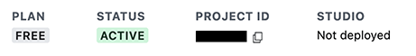
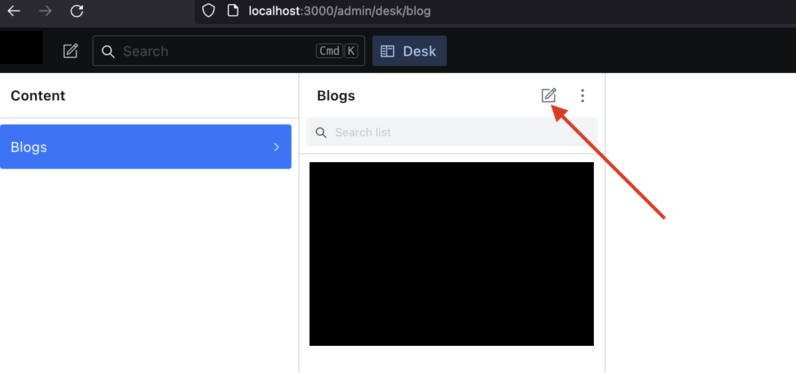
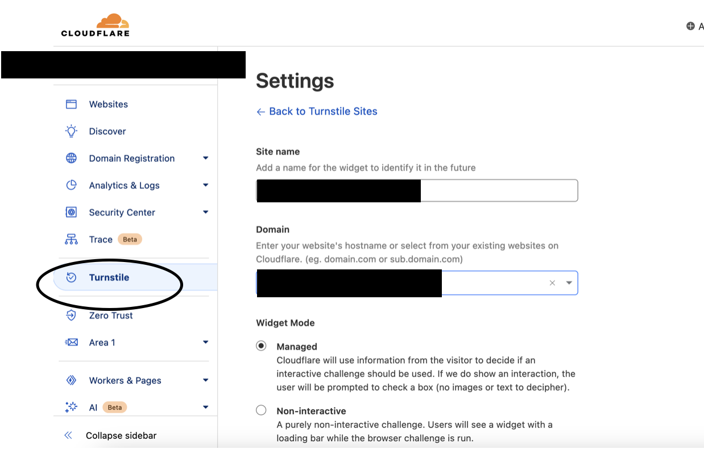
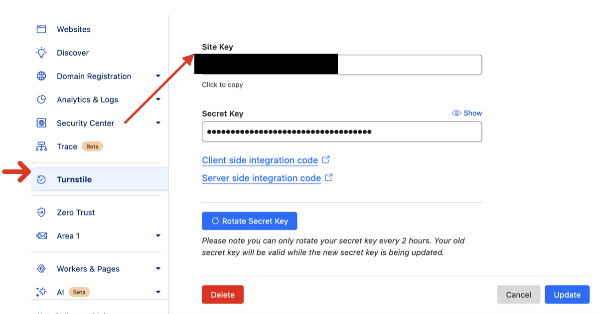
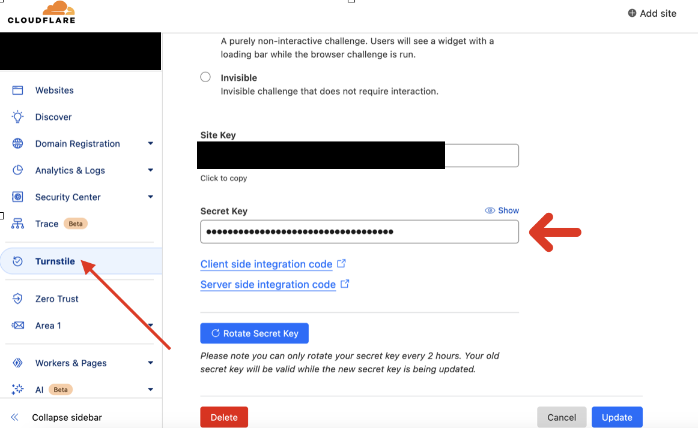
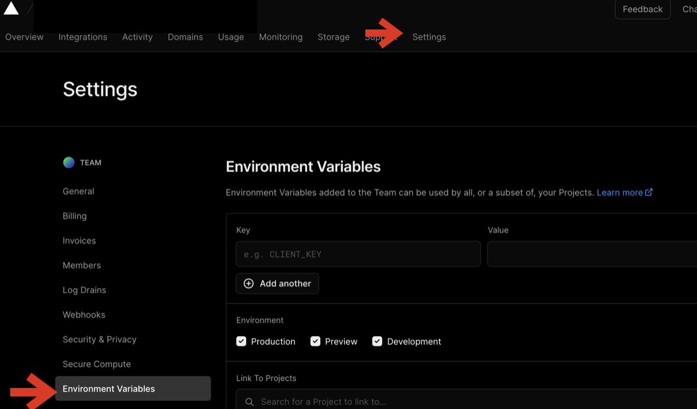
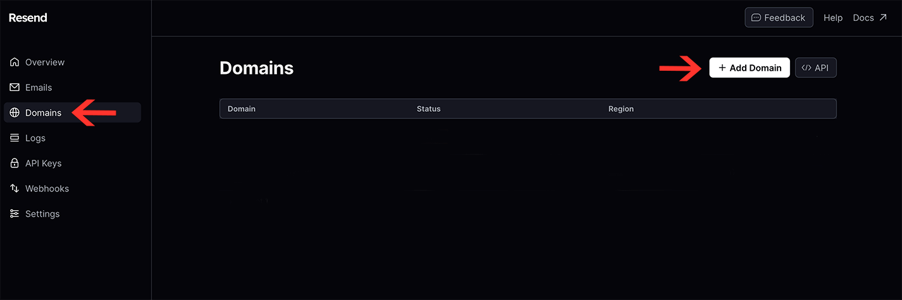
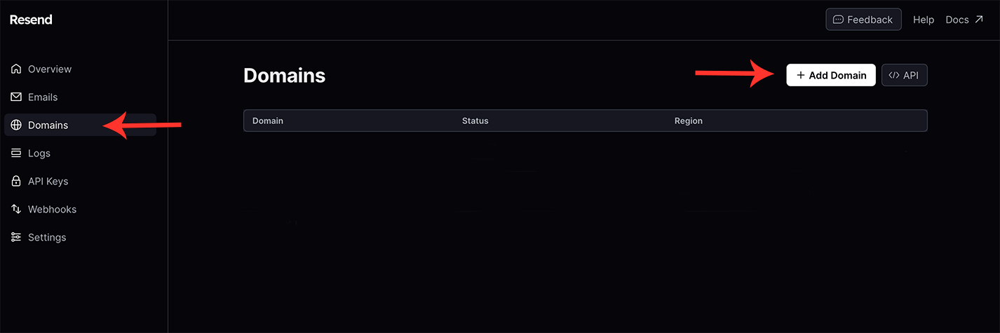

# <b>Getting Started</b>

## Introduction

Welcome to Moderna. Thank you for downloading our template. In this guide, you will find all relevant information and tips for how to use our template. Please read these instructions carefully to continue. We hope you enjoy 🙂👍

## Quick Start

<ol>

<b><li>Unzip the Downloaded file</li></b>
After downloading the template, you will find a compressed zip file. Use your operating system's standard procedure to unzip the template:

   <ul> 
   <li>Windows - Extract Zip Files</li>
    <li>Mac OS - Double click to unzip</li>
    <li>Linux - Use Command line</li>
    </ul>

<b><li>Edit in Code Editor</li></b>

Inside the ZIP file, you will find two folders. One is a <b>Documentation</b> file which will give you access to this documentation's website (the one you are reading now) and then the main project folder. In this case, the project folder name is moderna-template.

Open this folder in your favorite code editor. We recommend VSCode. Now open the terminal inside the IDE. (Ctrl + `) and run the command as shown in the next step.

<b><li>Run Commands</li></b>

Next, to setup your newly downloaded template please run the following commands in the terminal:
<br />
To install all relevant packages:

```
npm install
```

To run the theme locally on your computer:

```
npm run dev
```

<i>\*Note: When running the theme locally, you will notice NextJS is outdated with v13.5. Do not update NextJS as this will cause issues with Sanity. We highly recommend leaving the NextJS version as is.</i>

</ol>

## Support

If this is your first time working with NextJS v13 App Router, we highly recommend reviewing the NextJS documentation:<br />
https://nextjs.org/docs/app/building-your-application/routing

For further in-depth knowledge NextJS has released a free course to learn App Router: <br />
https://nextjs.org/learn/dashboard-app

We also recommend checking out the MUI documentation for styling: <br />
https://mui.com/

For any specific questions about your new template, please feel free to send us an email at <b>support@turnkeythemes.com</b>.

## Credits

Photo by Quang Nguyen Vinh: https://www.pexels.com/photo/white-drone-flying-above-trees-2161322/

# <b>Styling</b>

app > utils > theme.js

This file is what powers MUI's CSS Vars provider. This theme is used throughout the whole template.

If you are looking to use a specific font, it will need to be imported and changed. For ease of use, we recommend google fonts.

This theme is highly customized for both light and dark modes. You will find the colors for both modes defined towards the top of the file and a palette object which uses the colors. MUI's extendtheme is what handles the dark mode in this template. It is part of MUI's Experimental CSS Variables. You can review the documentation here for more info about this:
https://mui.com/material-ui/experimental-api/css-theme-variables/customization/

The colors are defined by section. There's a theme for typography, captions, components, etc. You can add or change colors to this file depending on your needs.

To use the theme for any other page you create, use import <b>{ useTheme } from "@mui/material/styles";</b> at the top of your page. Then make sure to set a variable that calls this function as follows:

```
const theme = useTheme();
```

# <b>Images</b>

All image assets are stored in the <b>public</b> directory.

# <b>Pages</b>

## Home Page

app > page.js OR <br />
app > home2 > page.js

Both options for the Home page are in the app folder

In either page.js you will import what components you would like to see on your home page. In our demo, we're using the Hero, ClientSection, BlogCard, CTA, Services, and Quote components in the app > page.js

## Services Page

app > (navigation) > services > page.js

This page includes the PagesHeader, Buttonbar, and ServicesComponent. Most of the data for this page will be handled by the ServicesComponent. The content for the services will have to be set in the following file:
app > utils > data > services.js
Please go [here](#services-content) for more information.

### Individual Service Pages

app > (navigation) > services > individual-service-name > page.js

Each Service listed in the Services page redirects to more information about that specific service. Every folder under the (navigation) > /services folder is the page that explains each service in further detail. Our demo includes 4 services. An example of an individual service page would be <b>app > (navigation) > services > web-development > page.js</b>. To route to the web development page it would be your-domain/services/web-development in your browser. To set the content of the individual services go to this file:
app > utils > data > services.js
Please go [here](#individual-service-page) for more information.

## About Page

app > (navigation) > about > page.js

This page is dependent upon MUI next/image. This page is also already accounting for desktop, tablet, and mobile views for responsiveness. If you would like to customize how the page looks, adjust alignment, padding, margins, line breaks, typography variants, etc.

All text is within Typography components.

Alignment of the page appearance is dependent on the Grid component.

Add desired images inside Image components.

## Blog Page/Sanity CMS

src > app > navigation > blog/blog2 > page.js

There are two layouts for this page. Both layouts are under <b>app > components > Blog</b> <br/>
<i>\*Note: For BlogLayout2 will have to ensure that the image sizes match the size in the demo. This is what creates the masonry layout. We have left a dummy array with the images of the BlogLayout2 of our demo. </i>

Both layouts are commented in their respective page.js files. You will have to uncomment the one you choose to use. <b>For Sanity to work, you will need to uncomment everything within the useEffect in the following file: app > utils > context > blogContext.js</b>

This blog section is integrated with Sanity. Sanity is a free-to-use headless content management system (CMS). You will need an account and a project ID for functionality.

### Get Started with Sanity CMS

You can get started and create an account with Sanity here: https://www.sanity.io/

After creating your account, you will be prompted to create your first project. After answering a few questions and entering a project title you can go to the following url:<br />
https://www.sanity.io/manage/

Click on the project you created, at the top you will see your details and a Project Id:


After finding this in your Sanity account, you need to add it to the <b>sanity.config.js</b> file:

```
projectId: "your-project-id-here",
```

You also need to add it here <b>sanity > imageUrl.js</b>:

```
projectId: "your-project-id-here",
```

The last file to add it in is <b>sanity > schemas > sanity-utils.js</b>. There are two functions here getBlog and getBlogs, you will have to add it to both:

```
projectId: "your-project-id-here",
```

### Upload your content

While running this template locally, you can navigate to localhost:3000/admin to access the sanity studio dashboard. You will have to login with your credentials to continue. After you have your schemas, which will immediately display within Sanity Studio, you can add your first blog article here:



### Content Fetching and Formatting

We have created the server side fetching and formatting for you. You can find this in the following file: <br/>

app > api > blog > route.js

The dynamic routing for all the blog pages are under the following folder: <br/>
app > blog > \[slug]

Basic formatting for blog pages can be found within the components:<br />
src > app > components > Blog > createIndividualBlog & styleBlogContent.

Sanity Studio is reading from sanity.config.js in the app > admin folder

### Customizing Sanity CMS Schemas

The <b>sanity</b> directory contains a schema folder where not only the schemas are stored, but also where the <b>index.js</b>, <b>sanity-utils.js</b>, and <b>imageUrl.js</b> files are stored. If you create any more schemas, it is also recommended to keep them in the schema folder.

We have created a GROQ query file that communicates with Sanity Studio to extract the fields you want to display. You can find this here: <b>/sanity > schemas > sanity-utils.js</b>

<b>index.js</b> is where you will import any new schemas you have created and add it to the schemas array. This is how Sanity Studio knows what schemas to read and populate.

If you add a new field in any of your schemas, you will need to go to the GROQ query in the sanity-utils.js file and add it there. This file has two functions, getBlogs and getBlog that work together to extract from within your Sanity Studio. To add more documents, you will have to create additional functions. Please make sure to match the following line to what is in your schema.

```
groq`\*[_type == ""]
```

Example: the blog-schema.js is "blog." The GROQ query type should then be <b>[_type == "blog"]</b>

## Contact Page

src > app > navigation > contact > page.js

Our contact page uses two APIs: Cloudflare's Turnstile and Resend. Cloudflare's Turnstile is a CAPTCHA replacement for human verification. Resend is a developer-friendly email sending platform to test and deliver emails made for ease of use.

Both APIs are free to use but you will need to create an account for both to configure the proper functionality. We have setup the server side validation and client side rendering for you.

### CloudFlare's Turnstile CAPTCHA Replacement

Create an account and get started here:
https://www.cloudflare.com/products/turnstile/

For the Turnstile to function properly you will need to register your domain, retrieve your sitekey, and retrieve your secret key.

#### Register your domain

Now that you have created your account you can add your site name, domain, and choose your desired widget mode in your CloudFlare account:



Now go to the following file:
app > api > verify > route.js

Add your domain in the following line:

```
"Access-Control-Allow-Origin": "https://your-domain-here.com",
```

#### Retrieve your site key

Now that you have your domain setup, let's retrieve your sitekey. This sitekey will be used to communicate with CloudFlare's API and provide extra security for your site. You can find this sitekey here:



Your sitekey will need to be added to the following widget component on the contact page:

```
<Turnstile
sitekey="000000000000000000000000"
appearance="always"
onSuccess={(token) => setToken(token)} />
```

If you wish, you can change the appearance as well. This will dictate when the widget appears. CloudFlare offers 'always', 'execute', or 'interaction-only' you can read more about this information in your CloudFlare Dashboard.

#### Retrieve your secret key

You can find your Secret Key below your Site Key in your CloudFlare dashboard:



We have added an environment variable to read this secret key. All that is needed is for you to add your Turnstile Secret Key in your production web server, where your website will be hosted. We highly recommend using Vercel to deploy this site.

If you are using Vercel, please make sure to set up the variable here:


For any other hosting services, please verify that the Secret Key is added as an environment variable there.

### Resend API for Emails

Get started here: https://resend.com/home

#### Register your domain

After creating an account, you will have to register your domain. You can find that here:



#### Create your API Key

Next, you will need to create an API Key here:


As with the CloudFlare Turnstile, we have added an environment variable to read the api key that you created. The next step is for you to add your Resend API Key to your production web server, where your website will be hosted. We highly recommend using Vercel to deploy this site.

If you are using Vercel, please make sure to add the API Key you created as an environment variable here:


For any other hosting services, please verify that the Resend API Key is added as an environment variable there.

#### Email Template

The email template you will receive in your inbox will come from this file:<br/>
app > components > Email

Here you can adjust the styling of the emails you will receive.

# <b>Components</b>

## Navigation Bar

To update the links of the navigation bar for both mobile and desktop adjust following file: <br/>

app > utils > data > nav_pages.js

Any styling changes will be in this file:
app > components > Navbar

## Hero

app > components > Hero

The Hero section has 3 different layouts. After choosing your desired layout, import it to the root page.js to see your chosen Hero layout.

## Services

### Services content

Add your services content and details for each service in the following file: <br/>
app > utils > data > services.js

<i>\*Note: If the spacing seems to be off when adding your images we highly recommend adjusting the size of the image first. If you adjust the padding or margin of the component keep in mind it will be adjusted in all the other places that this component is being used</i>

### Component details

The actual component can be found here:
app > components > ServicesComponent > services.js

This component is being reused in the following places:

<ol>
<li>Services section of the home page</li>
<li>Services Page</li>
<li>Service Details Page</li>
</ol>

The props include:

<ul>
<li>layout</li>
<li>contentName</li>
<li>showLearnMoreButton</li>
</ul>

This component has two different layouts. The first alternates the position of the image and text between left and right. The second layout only shows the text on the left.

### Individual Service Page

The second and third properties are used for the service-detail pages that are found here:<br />
app > (navigation) > services > individual-service > page.js

In these pages, you will set the name of the service in the <b>contentName</b>. The <b>showLearnMoreButton</b> will be set to false

## Footer

app > components > Footer

This component has 4 sections: logo, text, services links, nav links

The services links will automatically be updated when the content is changed in <b>app > utils > data > services.js</b>

The nav links can be changed in the <b>pages</b> variable in <b>app > utils > data > nav_links.js</b>

## Clients

app > components > Clients

For the content of this component navigate to: <br/>
app > utils > data > clients.js

In this array you can add the names and logos of the clients. You can also adjust the height and width of the logos in this file.

## Banners

### Blog Banner

app > components > Banners > blog.js

The Blog Banner is located in the home page. It provides a quick overview of 3 blog articles of your choosing. You can adjust these details in the following file: <br />

app > utils > data > blog.js

---
